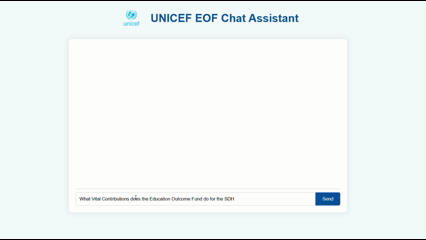

# UNICEF RAG AI Chatbot 🤖📚


## Overview

This project is a **Retrieval-Augmented Generation (RAG) AI chatbot** specifically built for **UNICEF's Education Outcomes Fund (EOF)**.  
It helps users **ask questions about official UNICEF/EOF reports**, retrieves relevant excerpts from stored PDFs, and **provides concise answers with sources**.  
It also includes a **summarization feature** for reports.  

The project is designed with a **professional, UNICEF-inspired UI**, making it ideal for educational research or internal data analysis.  

---

## 💻 Demo



---

## Features

- ✅ Answers questions related only to **UNICEF reports**  
- ✅ Summarizes long reports on request  
- ✅ Provides **source references** for transparency  
- ✅ Beautiful, professional UI with space for UNICEF logo  
- ✅ Easily extendable with more PDFs or powerful language models  

---

## Tech Stack

- **Backend:** Python, Flask, LangChain  
- **Frontend:** HTML, CSS, JS (UNICEF-inspired styling)  
- **Vector Database:** Chroma  
- **Embeddings & LLM:** Ollama  

---

## Ollama Methods Used

1. **Download Ollama** from [https://ollama.com](https://ollama.com) and install locally.  
2. **Download and use the following models in Ollama:**  
   - `llama3.2` → Primary chatbot LLM for question answering.  
   - `mxbai-embed-large` → Embedding model for vector search.  

> ⚡ You can use more powerful LLM models if you like, depending on your local resources and license.  

---

## Project Structure

RagAIChatbot/
│
├── main.py # Flask backend & chatbot logic
├── vector.py # PDF processing, embeddings, Chroma vector store
├── requirements.txt # Python dependencies
├── data/
│ └── pdf/ # Folder for UNICEF report PDFs
├── templates/
│ └── index.html # Frontend HTML
├── static/
│ ├── css/
│ │ └── style.css # Frontend styling
│ ├── js/
│ │ └── script.js # Frontend interactions
│ └── assets/
│ ├── unicef_logo.png # Placeholder for logo
│ └── demo.gif # Demo GIF of chatbot
└── README.md


---

## Setup Instructions

1. **Clone the repository**
```bash
git clone https://github.com/yourusername/RagAIChatbot.git
cd RagAIChatbot
Create and activate a virtual environment
```

```bash

python -m venv venv
# Windows
venv\Scripts\activate
# Mac/Linux
source venv/bin/activate
Install dependencies
```

```bash

pip install -r requirements.txt
Add UNICEF PDF reports
Place PDFs in data/pdf/.

Run the chatbot

```

```bash

python main.py
Open the UI
Visit http://127.0.0.1:5000 in your browser.

```

**Usage**
Type UNICEF-related questions in the input box.

Ask "summarize [report name]" to get a concise summary.

The chatbot only answers questions related to UNICEF reports.

Answers include a Sources section referencing the reports used.

**Contributions**
Contributions are welcome! Suggestions include:

Adding more PDFs for a richer knowledge base

Using more powerful LLMs for better answers

Improving UI/UX for mobile responsiveness

**License**
APACHE License 2.0 © 2025

**Screenshots / Demo Placeholder**


****Made with ❤️ for UNICEF research and educational insights.****